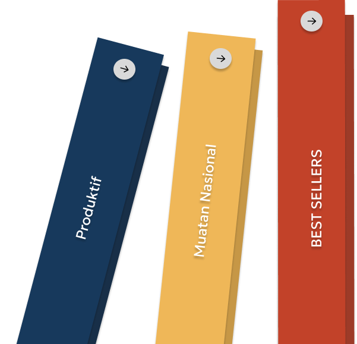

# 📚 LIBRY - Digital Library Web Application


**LIBRY** adalah aplikasi perpustakaan digital berbasis web yang memungkinkan pengguna untuk menjelajahi, membeli, membaca, dan melacak progres membaca buku secara online.

---

## 📸 Screenshots

| Landing Page | Dashboard | Reading Page |
|:---:|:---:|:---:|
|  | Dashboard dengan Continue Reading | Reader dengan highlight & progress |

---

## ✨ Fitur Utama

### 👤 Autentikasi & Profil
- Registrasi dan Login dengan hashing password (bcrypt)
- Upload foto profil
- Edit nama dan email
- Sistem membership otomatis (Member → Silver → Gold)

### 📖 Perpustakaan Digital
- Katalog buku dengan filter kategori
- Detail buku lengkap (author, publisher, harga, deskripsi)
- Halaman baca buku dengan konten lengkap

### 🛒 Sistem Pembelian
- Tambah ke keranjang (cart)
- Tambah ke favorit
- Checkout dengan pilihan metode pembayaran
- Diskon otomatis berdasarkan level membership

### 📊 Tracking Progres Membaca
- Progress bar real-time saat membaca
- Auto-save progress dengan `navigator.sendBeacon`
- Banner "Continue Reading" di dashboard
- Sistem reading streak harian

### ✏️ Fitur Highlight / Bookmark
- Highlight teks dengan 4 pilihan warna
- Hapus dan ubah warna highlight
- Highlight tersimpan di database (persist antar sesi)
- Marker visual di progress bar

### 🔍 Search Global
- Pencarian buku real-time dari semua halaman
- Dropdown hasil pencarian dengan cover, judul, author, kategori
- Badge "Owned" untuk buku yang sudah dibeli

### 🔔 Notifikasi
- Notifikasi welcome saat login
- Notifikasi pembelian berhasil
- Hapus satu per satu atau hapus semua

### 🎨 Pengaturan Tampilan Reader
- Tema: Light, Sepia, Dark
- Ukuran font yang bisa diatur (14px - 32px)
- Pengaturan tersimpan di database

---

## 🛠️ Tech Stack

| Teknologi | Kegunaan |
|-----------|----------|
| **PHP** | Backend logic, session management, server-side rendering |
| **MySQL / MariaDB** | Database untuk menyimpan semua data |
| **HTML5** | Struktur halaman web |
| **CSS3** | Styling & responsive design |
| **JavaScript (Vanilla)** | Interaktivitas frontend, AJAX, DOM manipulation |
| **Laragon / XAMPP** | Local development server |

---

## 📁 Struktur Folder

```
LIBRY/
├── index.php                  # Landing page
├── styles.css                 # Stylesheet utama
│
├── actions/                   # Backend logic (API endpoints)
│   ├── auth_signin.php        # Proses login
│   ├── auth_signup.php        # Proses registrasi
│   ├── clear_notifications.php # Hapus notifikasi (AJAX)
│   ├── search_books.php       # API pencarian buku global
│   ├── sync_book_data.php     # Simpan progress baca & highlight
│   ├── sync_settings.php      # Simpan pengaturan tema & font
│   └── upload_pfp.php         # Upload foto profil
│
├── asset/                     # Gambar & media
│   ├── avatars/               # Foto profil user
│   ├── logo.png               # Logo LIBRY
│   └── *.png                  # Cover buku
│
├── components/                # Komponen reusable
│   ├── sidebar.php            # Navigasi sidebar
│   └── top_navbar.php         # Navbar atas (search, notif, profil)
│
├── config/
│   └── koneksi.php            # Koneksi database
│
├── database/
│   ├── libry_db.sql           # Schema database utama
│   ├── update_books_1.sql     # Data buku batch 1
│   ├── update_books_2.sql     # Data buku batch 2
│   └── update_books_3.sql     # Data buku batch 3
│
└── page/                      # Halaman-halaman utama
    ├── about.php              # Halaman About Us & Membership
    ├── cart.php               # Keranjang belanja
    ├── checkout.php           # Halaman pembayaran
    ├── dashboard.php          # Dashboard / Home
    ├── detail.php             # Detail buku
    ├── favourite.php          # Daftar favorit
    ├── login.php              # Halaman login
    ├── logout.php             # Proses logout
    ├── profile.php            # Profil pengguna
    ├── read.php               # Halaman membaca buku
    ├── register.php           # Halaman registrasi
    └── shop.php               # Katalog / kategori buku
```

---

## 🚀 Cara Instalasi

### Prasyarat
- [Laragon](https://laragon.org/) atau [XAMPP](https://www.apachefriends.org/)
- PHP 7.4+
- MySQL / MariaDB

### Langkah-langkah

1. **Clone atau Download** project ini ke folder `www` (Laragon) atau `htdocs` (XAMPP)
   ```
   C:\laragon\www\LIBRY\
   ```

2. **Import Database**
   - Buka phpMyAdmin (`http://localhost/phpmyadmin`)
   - Jalankan file SQL secara berurutan:
     ```
     1. database/libry_db.sql        (schema + data dasar)
     2. database/update_books_1.sql  (buku batch 1)
     3. database/update_books_2.sql  (buku batch 2)
     4. database/update_books_3.sql  (buku batch 3)
     ```

3. **Konfigurasi Database** (jika perlu)
   - Edit `config/koneksi.php`
   - Sesuaikan `$host`, `$user`, `$pass`, dan `$db`

4. **Akses Aplikasi**
   ```
   http://localhost/LIBRY/
   ```

### Akun Default
| Username | Password |
|----------|----------|
| `Libry` | `libry123` |

---

## 📊 Struktur Database

```
libry_db
├── users            # Data pengguna (nama, email, password, tema, streak)
├── categories       # Kategori buku
├── books            # Data buku (judul, author, harga, konten)
├── favourites       # Buku favorit user
├── cart             # Keranjang belanja user
├── purchases        # Riwayat pembelian
└── user_book_data   # Progress baca & highlight per user per buku
```

---

## 🔒 Keamanan

- ✅ Password di-hash dengan **bcrypt** (`password_hash` / `password_verify`)
- ✅ Semua query database menggunakan **Prepared Statements** (anti SQL Injection)
- ✅ Output di-escape dengan **htmlspecialchars** (anti XSS)
- ✅ Session-based authentication
- ✅ File upload divalidasi tipe MIME-nya

---

## 👨‍💻 Dibuat Oleh

- Ananda Yosi Marsania (5) (hipster)
- Earlene Nuri Aulia (9) (hipster)
- Griselda Felixia Santoso (12) (hustler)
- Zahida Hulwa Fadila(32) (hacker)

---

## 📄 Lisensi

Project ini dibuat untuk keperluan edukasi.
